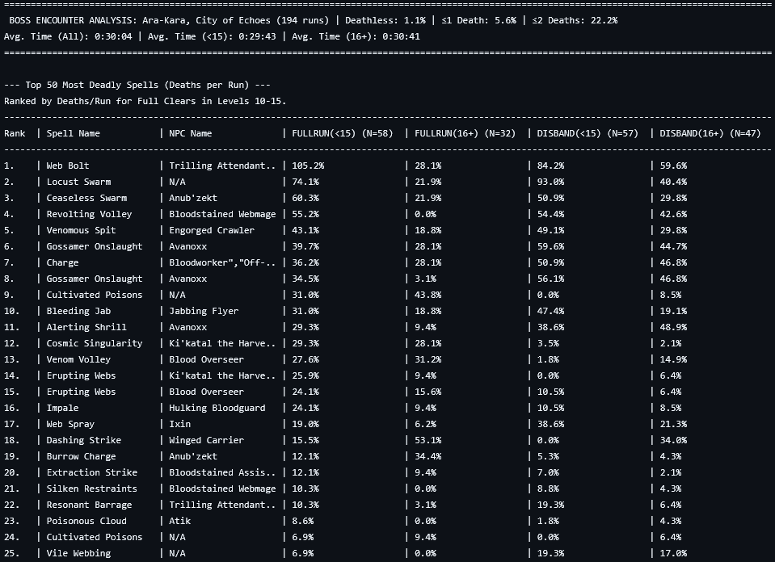
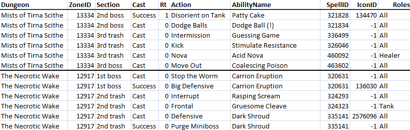

# Death statistics scraper

Various helper scripts to test and validate spell data for my Interface mod: */say Callouts M+*.

This code served two purposes; first, it would iterate over each row of hand-written spell data in my Excel-spreadsheet to see if the spell data I had recored in-game matched spell data scraped from the wowhead website (it also tried to parse the Lua-code generated via the in-game WeakAura editor to see if the data matched my spreadsheet data, but this was never fully implemented.)

Second, the code was able to fetch all public logs from Warcraftlogs.com for a given dungeon, and it would then for each spell_id record: *A: How often was the spell cast, and B: how often did that spell result in a player death*. This was very important for my design process, as I had to decide which spells should and shouldn't trigger an alert in my interface. Unlike most other mods that did something similar, I put a lot of effort into carefully configuring which spells should trigger an alert; if they were cast too frequently, or if they weren't lethal enough, people would consider the alerts too noisy.

The following image showcases an example of the summary data generated. The percentages are average number of deaths to each ability per run. There is also an image of a snippet of spreadsheet data.

